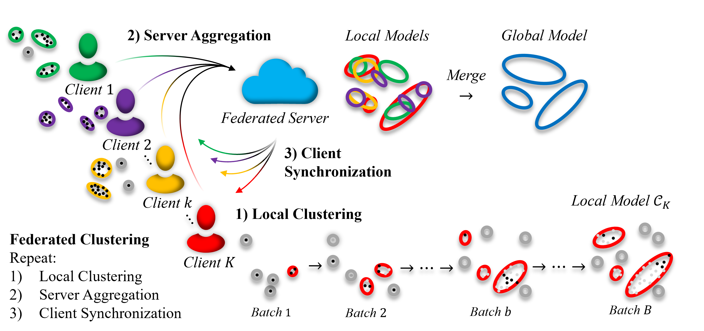

# eFedG: Evolving Federated Gaussian Clustering

This repository contains the implementation of the paper: **M. Ožbot, S. Ozawa, and I. Škrjanc**,**"Unsupervised Federated Learning Based on Evolving Gaussian Clustering,"**  
in 2025 IEEE International Conference on Fuzzy Systems (FUZZ-IEEE), July 2025, pp. 1–6. DOI: 10.1109/FUZZ62266.2025.11152249

<details>
  <summary><b>Abstract (click to expand)</b></summary>

We propose an unsupervised federated learning approach for evolving data stream clustering. One of the main challenges in federated clustering is selecting the number of clusters, as the data cannot be examined directly, and each client may have a distinct number of data clusters. Furthermore, data distributions in many real-world systems are not static but evolve over time due to changing environmental conditions, shifting processes, or behavioral patterns. To address these challenges, an Evolving Federated Gaussian Clustering (eFedG) method is proposed that adds and merges clusters over time, without assuming a predefined number of clusters. We propose a methodology for incremental clustering from mini-batches, with a merging mechanism that processes multiple cluster pairs simultaneously in a single step. This approach enables the system to handle heterogeneous data, as local clusters are learned independently and aggregated at the server based on overlap. The federated clustering method was examined on synthetic toy datasets, federated streaming clustering, and real network intrusion data.

</details>

---------------------------------------------------------------------

<p align="center">
  
</p>

Overview
--------
This repository contains the implementation of Evolving Federated Gaussian Clustering (eFedG) —
an unsupervised federated learning framework for evolving data stream clustering.
The system incrementally adds and merges clusters over time, enabling decentralized clustering
of heterogeneous, non-stationary data without a predefined number of clusters.

Key features
-------------
- **Unsupervised federated clustering** – No labels required.  
- **Online cluster addition and merging** – Dynamically adapts to evolving data distributions, no predefined number of clusters.  
- **Handles non-IID and evolving data streams** – Supports heterogeneous and time-varying inputs.  
- **Efficient batch-based updates for scalability** – Supports full or diagonal covariance, on CPU or GPU.  
---------------------------------------------------------------------

Repository structure
--------------------
```
eFedG/
├── model/                     # Core algorithms (clustering, merging, evolving mechanisms)
├── utils/                     # Dataset loaders, metrics, plotting, and training routines
├── related_methods/           # Baseline methods from the paper for comparison
├── main_clustering_noniid.ipynb   # Non-IID federated clustering benchmark
├── main_streaming.ipynb           # Streaming / evolving data scenario
├── main_scalability.ipynb         # Scalability analysis
├── requirements.txt
└── LICENSE
```
---------------------------------------------------------------------

Usage
-----

You can reproduce the experiments using the provided Jupyter notebooks:

- main_clustering_noniid.ipynb – Non-IID federated clustering
- main_streaming.ipynb – Streaming / evolving data experiment
- main_scalability.ipynb – Scalability study

The debug options in these notebooks are intentionally enabled to demonstrate the model’s
behavior, including how clusters evolve, merge, and adapt over the batches and rounds. These visualizations
and additional insights are provided to help illustrate the inner workings of the eFedG method.

---------------------------------------------------------------------

Model configuration parameters
-------------------------------
The following parameters define the configuration of the local and federated models
(the same in the experiments, but they can differ between client and server):
```
- **feature_dim**     — Dimension of input features.  
- **num_classes**     — Number of output classes (1 for unsupervised clustering).  
- **kappa_n**         — Threshold for the number of samples in a cluster sent to the server.
- **num_sigma**       — Number of standard deviations still considered as within cluster (controls spread of clusters).  
- **kappa_join**      — Cluster merging threshold in the range (0, 1]; lower values allow more merging.  
- **N_r**             — Quatization number, data covariance matrix divided by N_r is the initial estimate of each cluster covariance (larger means smaller clusters).   
- **c_max**           — Maximum number of clusters allowed in the model.  
- **kappa_features**  — Feature selection threshold.  
- **device**          — Computation device (CPU or CUDA).  
- **thr_relevance**   — Cluster relevance threshold in the range (0.95, 1]; controls removal of weak clusters, generally close to 1.  
```